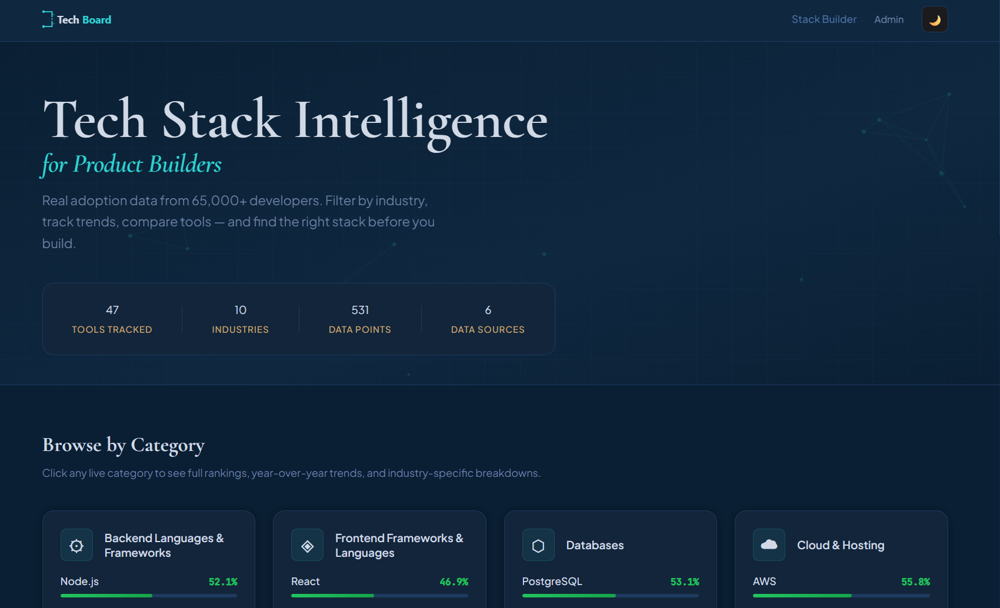
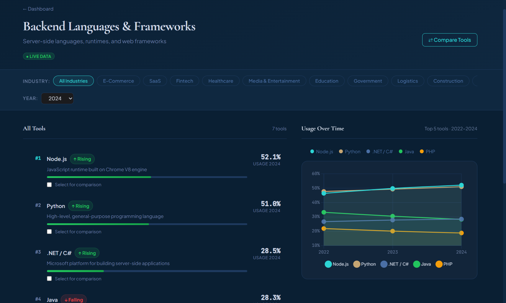
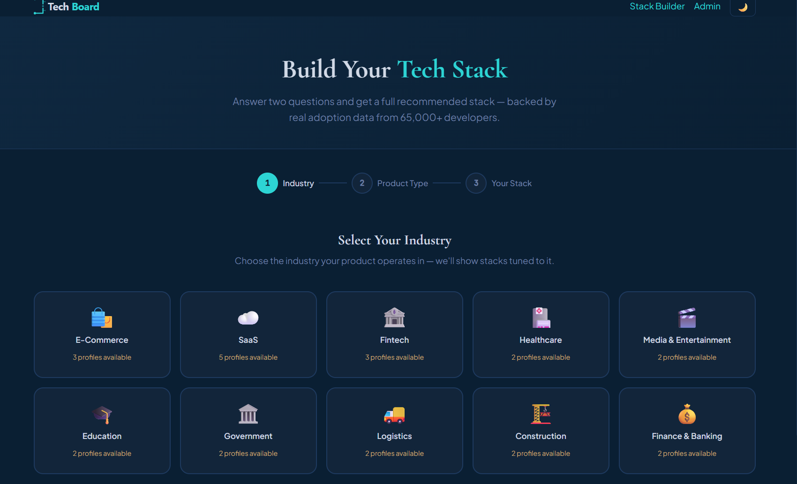
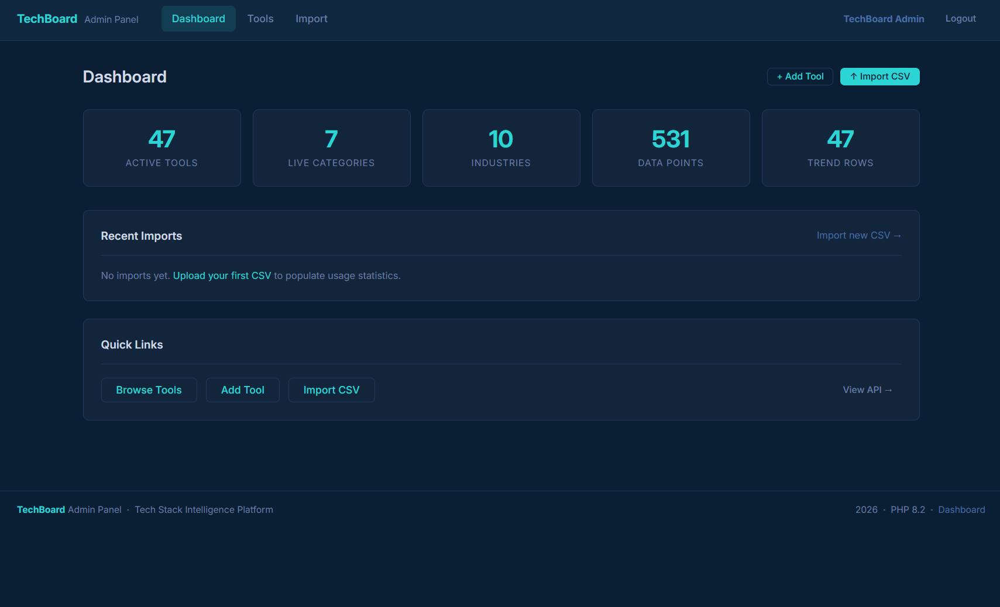
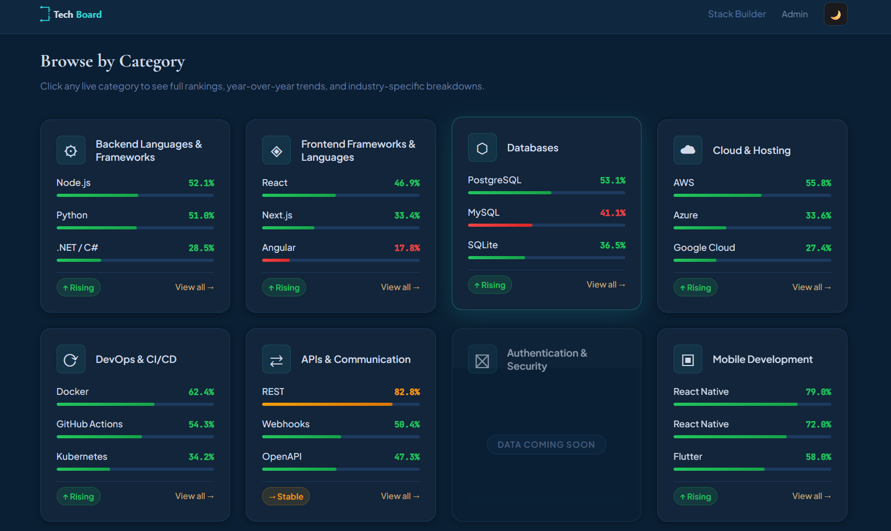
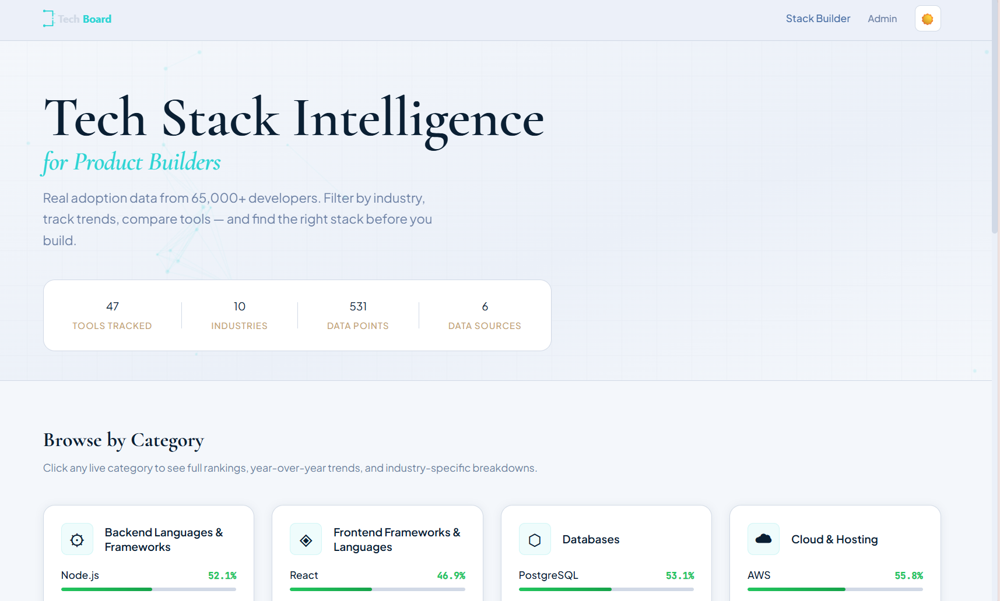

# TechBoard — Tech Integration Intelligence Board

> A full-stack web platform that tracks which technical tools and infrastructure decisions companies are actually adopting. Built as deployable research infrastructure backed by real developer survey data.

---

## Why TechBoard Exists

There is no universally correct tech stack. The right tool depends on your industry, your use case, and what you are actually building. Optimization is not about finding the best tool in the abstract — it is about finding the right tool for your specific context.

The problem is that researching that context is hard. Information is scattered across surveys, blog posts, and Reddit threads, none of it organized by industry or use case. TechBoard pulls that data into one place. It uses real adoption numbers from Stack Overflow, State of JS, and JetBrains developer surveys to show which tools developers are actually using — broken down by category and industry. It does not tell you what to use. It gives you the data to consult and make that decision yourself.

The roadmap includes direct tool comparisons, capability breakdowns, and trade-off analysis — expanding it from adoption trends into a fuller reference for anyone who wants to understand the technology landscape before making a decision.

---

## Architecture

```
                        ┌─────────────────────────────────────────────┐
                        │              Docker Network                  │
                        │                                              │
  Browser               │  ┌──────────────┐     ┌──────────────────┐  │
     │                  │  │   Frontend   │     │     Backend      │  │
     │  HTTP :80        │  │   nginx      │────▶│   Node.js/       │  │
     └─────────────────▶│  │   Alpine     │     │   Express        │  │
                        │  │              │     │   :3000          │  │
  Admin Browser         │  └──────────────┘     └────────┬─────────┘  │
     │                  │                                │             │
     │  HTTP :8080      │  ┌──────────────┐             │  SQL        │
     └─────────────────▶│  │    Admin     │      ┌──────▼──────────┐  │
                        │  │   PHP 8.2/   │─────▶│     MySQL       │  │
                        │  │   Apache     │      │     8.0         │  │
                        │  │   :8080      │      │     :3306       │  │
                        │  └──────────────┘      └──────▲──────────┘  │
                        │                               │  SQL        │
                        │  ┌──────────────┐             │             │
                        │  │ Intelligence │─────────────┘             │
                        │  │  Flask/      │                           │
                        │  │  Python      │◀──── Node calls Flask     │
                        │  │  :5001       │      internally via HTTP  │
                        │  └──────────────┘                           │
                        └─────────────────────────────────────────────┘
```

**Request flow:**
1. Browser → nginx (port 80) → serves static HTML/CSS/JS
2. JS fetch/jQuery AJAX → nginx reverse proxy → Node.js API (port 3000)
3. Node.js → MySQL for all CRUD and stat queries
4. Node.js → Flask (port 5001) for trend analysis and pattern detection
5. Flask → MySQL independently for analytical queries
6. Admin browser → PHP panel (port 8080) → MySQL directly via PDO

---

## Tech Stack

| Technology | Version | Role | Why |
|---|---|---|---|
| **Node.js / Express** | 18+ / 4.x | REST API backend | Non-blocking I/O ideal for a data-heavy API; large ecosystem |
| **MySQL** | 8.0 | Primary relational database | Structured survey data maps naturally to relational tables; FOREIGN KEY integrity |
| **Python / Flask** | 3.11+ / 3.x | Intelligence microservice — trend analysis, pattern detection, comparisons | Python's data ecosystem fits analytical work; Flask is lightweight |
| **PHP 8.2 / Apache** | 8.2 | Admin panel — tool/data management | Server-side scripting; PDO for safe parameterised queries |
| **nginx (Alpine)** | latest | Frontend static file server + API reverse proxy | Efficient static serving; reverse proxy eliminates CORS issues in production |
| **Docker / Compose** | 3.8 | Container orchestration — runs all 5 services with one command | Reproducible environments; no "works on my machine" problems |
| **Vanilla JS + jQuery** | ES6+ / 3.x | Frontend interactivity and DOM manipulation | Direct DOM control; jQuery for AJAX and dynamic content |
| **Chart.js** | 4.x | Usage-over-time charts | Lightweight, integrates cleanly with JSON API responses |
| **HTML5 / CSS3** | — | Semantic markup, responsive layout, dark/light mode | Native web standards; CSS custom properties for theme switching |
| **JWT** | — | Admin authentication on protected API routes | Stateless auth — no server-side sessions needed |
| **XML** | — | Data export feed and import processing | Standard data interchange format |

---

## Prerequisites

- **Docker Desktop** with WSL2 backend enabled (Windows) or Docker Engine (Linux/macOS)
- **Git**
- No local Node.js, Python, or PHP installation required — Docker handles everything

---

## Setup & Run

### 1. Clone the repository

```bash
git clone https://github.com/YOUR_USERNAME/techboard.git
cd techboard
```

### 2. Create your environment file

```bash
cp .env.example .env
```

Open `.env` and fill in all values:

```env
DB_ROOT_PASSWORD=your_root_password
DB_USER=techboard_user
DB_PASSWORD=your_db_password
JWT_SECRET=your_jwt_secret_min_32_chars
ADMIN_SECRET=your_admin_secret
```

### 3. Build and start all services

```bash
docker compose up --build
```

Docker will build all images, run the database seed files, and wait for MySQL to be healthy before starting the API and admin panel. First build takes 2–4 minutes.

### 4. Verify everything is running

```bash
docker compose ps
```

All five containers should show `Up` or `healthy`.

### 5. Open the application

| Service | URL |
|---|---|
| **Dashboard** | http://localhost |
| **Admin Panel** | http://localhost:8080 |
| **API** | http://localhost:3000 |
| **API Health** | http://localhost:3000/health |
| **Flask Health** | http://localhost:5001/intelligence/health |

### Useful commands

```bash
docker compose up -d               # run in background
docker compose logs -f backend     # follow Node.js logs
docker compose down                # stop (keeps data)
docker compose down -v             # stop and wipe database
docker compose exec mysql mysql -u root -p techboard   # MySQL shell
```

---

## API Endpoints

### Public

| Method | Path | Description |
|---|---|---|
| `GET` | `/api/categories` | All 15 technical categories |
| `GET` | `/api/categories/:slug` | Single category detail |
| `GET` | `/api/tools` | All active tools |
| `GET` | `/api/tools/:slug` | Single tool detail |
| `GET` | `/api/industries` | All 10 industry filters |
| `GET` | `/api/stats/top` | Top N tools in a category; optional `?industry=` filter |
| `GET` | `/api/stats/global` | Platform-wide summary counts |
| `GET` | `/api/stats/usage` | Historical usage % for one tool — Chart.js data |
| `GET` | `/api/trends` | Trend scores from Flask intelligence engine |
| `GET` | `/api/stack-builder` | Recommended stack for a given industry and product type |
| `GET` | `/feed.xml` | Full data export as XML |
| `GET` | `/health` | API liveness probe |

### Intelligence Engine (Flask — port 5001)

| Method | Path | Description |
|---|---|---|
| `GET` | `/intelligence/health` | Flask + MySQL connectivity check |
| `GET` | `/intelligence/trends` | Trend scores with direction (rising / stable / falling) |
| `GET` | `/intelligence/rising` | Tools with the strongest upward trend |
| `GET` | `/intelligence/patterns` | Cross-category adoption patterns |
| `GET` | `/intelligence/compare` | Side-by-side comparison of two tools |

### Admin (JWT required)

| Method | Path | Description |
|---|---|---|
| `POST` | `/api/auth/login` | Authenticate and receive JWT |
| `POST` | `/api/stats` | Manually insert a usage stat row |

---

## Folder Structure

```
techboard/
├── docker-compose.yml
├── .env.example
├── .gitignore
│
├── database/
│   ├── schema.sql              # 8-table schema
│   ├── seed_categories.sql
│   ├── seed_industries.sql
│   └── seed_sample_data.sql
│
├── backend/                    # Node.js / Express
│   ├── server.js
│   ├── config/
│   ├── middleware/
│   ├── routes/
│   └── utils/
│
├── frontend/                   # Static files (nginx)
│   ├── index.html              # Dashboard
│   ├── category.html
│   ├── stack-builder.html
│   ├── css/
│   ├── js/
│   └── nginx.conf
│
├── admin/                      # PHP 8.2 admin panel
│   ├── index.php
│   ├── login.php
│   ├── includes/
│   ├── tools/
│   └── import/
│
├── intelligence/               # Python / Flask
│   ├── app.py
│   ├── db.py
│   ├── routes/
│   └── analysis/
│
└── screenshots/
```

---

## Data Sources

| Survey | Publisher | Respondents | Used For |
|---|---|---|---|
| **Stack Overflow Annual Developer Survey** | Stack Overflow | ~90,000/year | Broad technology adoption |
| **State of JS Survey** | Sacha Greif et al. | ~30,000/year | JavaScript ecosystem |
| **JetBrains Developer Ecosystem Survey** | JetBrains | ~26,000/year | DevOps, backend, tooling |

---

## Screenshots

| Dashboard | Category Detail |
|-----------|-----------------|
|  |  |

| Stack Builder | Admin Panel |
|---------------|-------------|
|  |  |

| Dark Mode | Light Mode |
|-----------|------------|
|  |  |

---

## Academic Context

This project was built for the **Web Technologies course (Tehnologii WEB), 2nd Year, Informatics, Titu Maiorescu University, Bucharest**. The course requires demonstrating proficiency across the full web stack — from database design to server-side scripting to frontend interaction.

Every technology below was a course requirement. The architecture was designed so each one plays a real, non-trivial role rather than being bolted on just to tick a box.

| Course Requirement | Where It Appears in This Project |
|---|---|
| **HTML5** | `frontend/*.html` — semantic elements (`nav`, `main`, `section`), data attributes, SVG |
| **CSS3** | `frontend/css/` — custom properties, Flexbox, Grid, transitions, dark/light mode |
| **JavaScript** | `frontend/js/` — ES6+, async/await, fetch API, DOM manipulation |
| **jQuery** | `frontend/js/dashboard.js`, `category.js` — AJAX calls, dynamic DOM updates |
| **Node.js** | `backend/` — Express REST API, MySQL connection pool, JWT authentication |
| **PHP** | `admin/` — session-based auth, PDO MySQL, CSV file upload and processing |
| **MySQL** | `database/` — 8-table relational schema, foreign keys, correlated subqueries |
| **XML** | `backend/routes/xml.js` — `/feed.xml` data export; admin import pipeline |
| **Flask (Python)** | `intelligence/` — Python microservice for trend analysis and statistical comparison |

---

## Future Roadmap

- Live data scraping pipeline from Stack Overflow and GitHub APIs
- User accounts with saved stacks and bookmarked comparisons
- VPS deployment with nginx reverse proxy and SSL
- Premium tier for enterprise industry breakdowns
- Adoption forecasting and trend prediction
